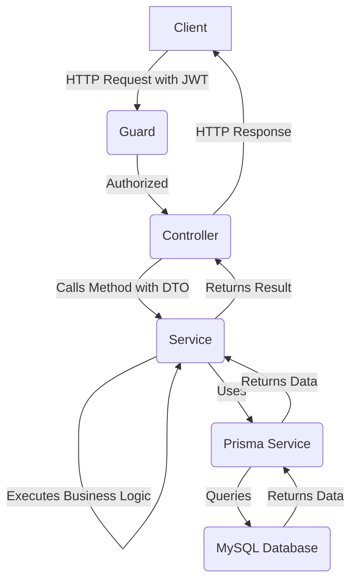

# 🎮 Games E-commerce API

This directory contains the core API for the Games E-commerce platform, built with **NestJS**. It provides a robust and scalable foundation for managing users, games, and other related functionalities.

---

## 🏛️ Architectural Overview

The API is designed following a modular, layered architecture, which is a core principle of NestJS. This separation of concerns makes the application easier to maintain, scale, and test. The main layers of the architecture are:

1.  **Controllers:** Handle incoming HTTP requests and send back responses.
2.  **Services:** Contain the business logic and interact with the data access layer.
3.  **Data Access Layer (Prisma):** Manages all interactions with the database.

### Modular Design

The application is divided into **modules**, where each module encapsulates a specific feature or domain. The primary modules are:

* **`AuthModule`**: Manages user authentication, including JWT strategy, login, and registration.
* **`UsersModule`**: Handles all CRUD operations related to user data.
* **`GamesModule`**: Manages the game catalog, including creating, retrieving, updating, and deleting games.

This modular structure allows for better organization and scalability. Each module has its own controllers, services, and providers, making it a self-contained unit of functionality.

### Request Lifecycle

Here is a simplified overview of how a typical request is processed:

1.  An **HTTP request** arrives at the server and is routed to the appropriate **Controller** based on the endpoint and HTTP method.
2.  The **Controller** validates the incoming data (e.g., using DTOs - Data Transfer Objects) and calls the corresponding method in the **Service**.
3.  The **Service** executes the core business logic. This may involve calculations, data transformations, or interacting with other services.
4.  For database operations, the **Service** communicates with the **Prisma Service**, which abstracts away the database queries.
5.  The **Prisma Service** executes the query against the **MySQL** database.
6.  The data flows back through the layers, and the **Controller** sends the final **HTTP response** to the client.



## 📁 Folder Structure

The project follows the standard NestJS project structure, which promotes consistency and maintainability.
```bash
/src
|
|-- /auth                # Authentication module
|   |-- /dto
|   |-- /guards
|   |-- /strategies
|   |-- auth.controller.ts
|   |-- auth.module.ts
|   `-- auth.service.ts
|
|-- /games               # Games module
|   |-- /dto
|   |-- games.controller.ts
|   |-- games.module.ts
|   `-- games.service.ts
|
|-- /users               # Users module
|   |-- /dto
|   |-- users.controller.ts
|   |-- users.module.ts
|   `-- users.service.ts
|
|-- /prisma              # Prisma service and configuration
|   |-- prisma.service.ts
|
|-- app.module.ts        # Root application module
`-- main.ts              # Application entry point
```