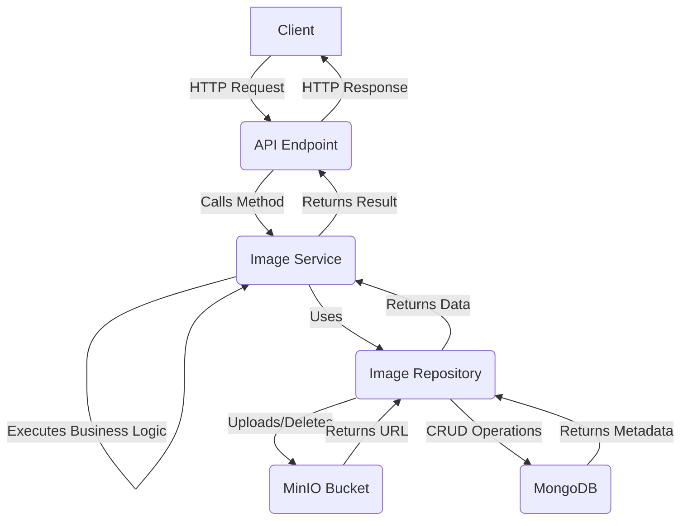

# 🖼️ Image Service

This directory contains the `image_service`, a FastAPI-based microservice designed for handling image uploads, storage, and management. It serves as a dedicated component within the broader Games E-commerce Platform.

The service leverages **MinIO** for S3-compatible object storage and **MongoDB** to store image metadata, providing a robust and scalable solution for handling image assets.

---

## ✨ Features

* **Image Upload**: Upload images with a `user_id` to associate them with a user.
* **Metadata Storage**: Stores comprehensive image metadata in MongoDB, including filename, object name, URL, content type, size, and upload date.
* **Image Retrieval**: Fetch image metadata by its unique ID.
* **Image Updates**: Replace an existing image with a new file.
* **Image Deletion**: Remove an image and its associated metadata.
* **File Type Validation**: Ensures that only files with an "image/" content type can be uploaded.

---

## 🏛️ Architectural Overview & Request Lifecycle

The service follows a layered architecture to separate concerns and improve maintainability.

1.  **API Layer (Endpoints)**: Handles incoming HTTP requests. It's responsible for request validation and forwarding the request to the service layer.
2.  **Service Layer**: Contains the core business logic. It processes the requests, interacts with the repository layer, and handles any exceptions.
3.  **Repository Layer**: Interacts with the data storage systems (MinIO and MongoDB) to perform CRUD operations.



## 📁 Folder Structure

The project follows a modular structure to keep the codebase organized and maintainable.
```bash
/image_service
|
|-- /app
|   |-- /api
|   |   `-- /v1
|   |       `-- /endpoints
|   |           `-- image.py        # API routes for image handling
|   |-- /core                       # Core application logic
|   |   |-- config.py               
|   |   |-- exceptions.py           
|   |   `-- logging.py              
|   |-- /repository                 # Data access layer
|   |   |-- /mongo
|   |   |   `-- image.py            # Pydantic model for image metadata
|   |   |-- exceptions.py           
|   |   `-- image_repository.py     
|   |-- /services                   # Business logic layer
|   |   |-- exceptions.py           
|   |   `-- image_service.py        
|   |-- /tests                      # Unit and integration tests
|   |   `-- test_image_service.py   
|   `-- main.py                     # FastAPI application entry point
|
|-- dev.Dockerfile                  
|-- prod.Dockerfile                 
|-- docker-compose.dev.yml
|-- docker-compose.prod.yml
|-- docker-compose.yml
|-- pyproject.toml
`-- uv.lock
```

---

## 🛠️ Core Technologies

* **[FastAPI](https://fastapi.tiangolo.com/)**: A modern, high-performance web framework for building APIs with Python.
* **[MinIO](https://min.io/)**: A high-performance, S3-compatible object storage solution.
* **[MongoDB](https://www.mongodb.com/)**: A NoSQL document-oriented database for storing image metadata.
* **[Docker](https://www.docker.com/) & [Docker Compose](https://docs.docker.com/compose/)**: For containerizing and running the application and its dependencies.

---

## 🔌 API Endpoints

The following endpoints are available:

| Method   | Endpoint              | Description                                                        |
| :------- | :-------------------- | :----------------------------------------------------------------- |
| `POST`   | `/image/upload/`      | Upload a new image. Requires `user_id` and a file.                 |
| `PUT`    | `/image/update/`      | Update an existing image. Requires `image_id`, `user_id`, and a file. |
| `GET`    | `/image/{image_id}`   | Retrieve metadata for a specific image.                            |
| `DELETE` | `/image/delete/`   | Delete an image and its metadata.                                  |
| `GET`    | `/docs`               | Access the FastAPI Swagger UI for interactive API documentation.   |

---

## 🚀 Getting Started

### Prerequisites

* Python 3.12+
* Docker and Docker Compose
* `uv` for Python package management

### Installation

1.  **Clone the repository:**
    ```bash
    git clone https://github.com/RoberthParreiras/games-e-commerce.git
    cd games-e-commerce/image_service
    ```
2.  **Set up the environment:**
    Create a `.env` file in the `image_service` directory and add the necessary environment variables. See the [Configuration](#-configuration) section for details.

3.  **Install dependencies:**
    It is recommended to use a virtual environment.
    ```bash
    uv venv
    source .venv/bin/activate
    uv sync
    ```

### Running the Service for development

*  You can ran the application with uvicorn command.
    ```bash
    uvicorn app.main:app --reload
    ```

## 🐳 Running the Application with Docker

For a streamlined setup, you can run the entire application using Docker Compose. When you run the script, this will start the databases and other services.

* **Development Mode:**
    (Includes features like hot-reloading for a better development experience)
    ```bash
    docker compose -f docker-compose.yml -f docker-compose.dev.yml up -d
    ```
* **Production Mode:**
    (Optimized for performance and stability)
    ```bash
    docker compose -f docker-compose.yml -f docker-compose.prod.yml up -d
    ```

## 🧪 Testing

* To ensure the reliability of the application, you can run the provided tests.
    ```bash
    pytest
    ```

---

## ⚙️ Configuration

Configure the service by creating a `.env` file in the `image_service` root directory with the following variables:

```env
# MinIO configuration for local development
MINIO_ENDPOINT=127.0.0.1:9000
MINIO_ROOT_USER=YOUR_ACCESS_KEY
MINIO_ROOT_PASSWORD=YOUR_SECRET_KEY
MINIO_BUCKET=YOUR_BUCKET_NAME
MINIO_SECURE=False

# MinIO configuration for docker
MINIO_ENDPOINT=minio:9000
MINIO_ROOT_USER=YOUR_ACCESS_KEY
MINIO_ROOT_PASSWORD=YOUR_SECRET_KEY
MINIO_BUCKET=YOUR_BUCKET_NAME
MINIO_SECURE=False # change this to indicate to use secure (TLS) connection to S3 service

# MongoDB configuration
MONGO_HOST=127.0.0.1
MONGO_PORT=27017
MONGO_INITDB_ROOT_USERNAME=your_mongo_user
MONGO_INITDB_ROOT_PASSWORD=your_mongo_password

# MongoDB configuration for docker
MONGO_HOST=mongodb
MONGO_PORT=27017
MONGO_INITDB_ROOT_USERNAME=your_mongo_user
MONGO_INITDB_ROOT_PASSWORD=your_mongo_password
